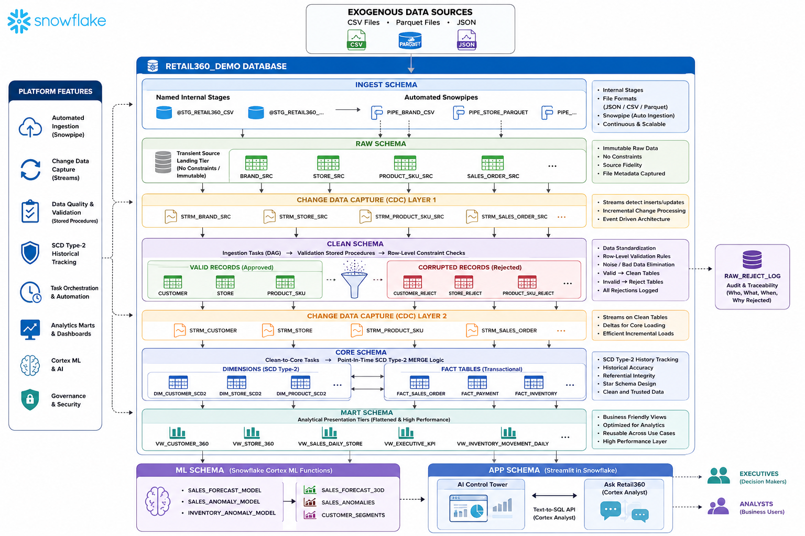

# Retail360: AI-Powered Enterprise Retail Analytics Platform on Snowflake

Retail360 is an enterprise-scale retail analytics platform built entirely within the **Snowflake Data Cloud**. The platform implements a fully automated Medallion Architecture with continuous data ingestion, enterprise data warehousing, native machine learning, and conversational AI analytics powered by Snowflake Cortex.



---

## 🌟 Highlights

*   **🚀 End-to-End Enterprise Data Pipeline:** Fully automated from source file arrival to final downstream insights.
*   **❄️ Built Natively on Snowflake:** ZERO reliance on external orchestration tools, compute nodes, or separate ML infrastructure.
*   **📊 Medallion Architecture:** Raw $\rightarrow$ Clean $\rightarrow$ Core $\rightarrow$ Mart logical isolation.
*   **🔄 Continuous Ingestion:** Automated event-driven file ingestion via Snowpipe.
*   **⚡ Change Data Capture (CDC):** Incremental data processing using Snowflake Streams.
*   **🤖 Native Machine Learning:** Time-series demand forecasting and anomaly detection via Snowflake Cortex ML Functions.
*   **💬 Conversational Analytics:** Natural language interfaces built on Snowflake Cortex Analyst (Text-to-SQL).
*   **📈 Streamlit in Snowflake (SiS):** Production-grade operations and executive dashboards deployed inside the data perimeter.
*   **🛡️ Data Quality & Governance:** Stream-driven row-level validation framework with automated reject isolation and Type-2 Slowly Changing Dimensions (SCD2).

---

## 📖 Project Overview

Retail360 demonstrates how modern organizations can architect a secure, cloud-native data platform directly inside the Snowflake ecosystem. 

Rather than relying on fragmented stacks (e.g., Airflow for orchestration, dbt for transformations, Python servers for ML), Retail360 leverages Snowflake's native feature set. Raw transaction, customer, and inventory records arrive as unstructured or semi-structured files, process incrementally through validation checks, manage history perfectly via SCD2 logic, and finally surface inside Streamlit applications. Business users can view predictions or safely ask complex analytics questions in plain text using Cortex Analyst, which securely translates natural language requests into governed SQL queries.

### 🎯 Core Engineering Focus
This repository serves as a showcase for production data engineering patterns, including:
*   Incremental ELT processing over batch re-computes.
*   Idempotent pipeline designs.
*   Defensive data validation structures (retaining good rows while isolating corrupted rows).
*   Granular Role-Based Access Control (RBAC) implementations.

---

## 🏆 Key Platform Capabilities


| Category | Capability | Snowflake Implementation Component |
| :--- | :--- | :--- |
| **Data Ingestion** | Continuous, multi-format file processing | Internal Stages, File Formats, Snowpipe |
| **Change Data Capture** | Row-level delta tracking | Snowflake Streams |
| **Data Validation** | Row-level validation and quarantine separation | Stored Procedures, Reject Tables & Logs |
| **Automation** | Dependency-driven pipeline scheduling | Snowflake Tasks (DAG execution) |
| **Warehouse Modeling** | Relational Star Schema with historical tracking | Facts, Dimensions, SCD Type-2 MERGE |
| **Machine Learning** | Out-of-the-box forecasting & anomaly tracking | Cortex Forecast & Anomaly Detection |
| **Generative AI** | Governed natural language analytics | Cortex Analyst (YAML Semantic Model) |
| **Visualization** | Interactive executive interfaces | Streamlit in Snowflake (SiS) |

---

## 📊 Architecture & Data Flow

```text
       Source Systems (CSV • JSON • Parquet)
                        │
                        ▼
             Internal Snowflake Stage
                        │ (Continuous Pipe Event)
                        ▼
             ┌─────────────────────┐
             │      RAW LAYER      │ ◄─── Immutable Storage & Metadata
             └─────────────────────┘
                        │
                 Snowflake Stream (CDC Delta Capture)
                        │
                        ▼
             ┌─────────────────────┐
             │     CLEAN LAYER     │ ◄─── Row-Level Validation Engine
             └─────────────────────┘
                 │             │
          (Valid Records) (Invalid Records)
                 │             │
                 ▼             ▼
       ┌───────────────┐ ┌───────────────┐
       │ Clean Tables  │ │ Reject Logs   │
       └───────────────┘ └───────────────┘
                 │
           Stored Procedures (SCD2 MERGE Logic)
                 │
                 ▼
             ┌─────────────────────┐
             │   CORE WAREHOUSE    │ ◄─── Star Schema (Facts + SCD2 Dims)
             └─────────────────────┘
                        │
             Business Analytical Marts (Optimized Materialized Views)
                        │
         ┌──────────────┴──────────────┐
         ▼                             ▼
  AI Control Tower               Ask Retail360
(Streamlit Dashboard)           (Cortex Analyst)

```

## 📈 Data Flow

```text

Retail Files
      │
      ▼
Snowpipe
      │
      ▼
RAW Layer
      │
      ▼
Streams
      │
      ▼
Validation Procedures
      │
 ┌────┴─────┐
 │          │
 ▼          ▼
Valid     Reject
Records   Records
 │          │
 ▼          ▼
Clean     Reject Log
 │
 ▼
Core Warehouse
 │
 ▼
Analytics Marts
 │
 ├────────► Streamlit Dashboard
 │
 └────────► Cortex Analyst

```
## 🛠 Technology Stack

Retail360 leverages Snowflake's native ecosystem to build a modern, cloud-native analytics platform without relying on external orchestration or machine learning frameworks.


| Category | Technologies |
| :--- | :--- |
| **Cloud Data Platform** | Snowflake |
| **Programming** | SQL, Python |
| **Data Ingestion** | Internal Stages, Snowpipe, File Formats |
| **Data Processing** | Streams, Tasks, Stored Procedures |
| **Data Warehouse** | Star Schema, Fact Tables, Dimension Tables, SCD Type-2 |
| **Analytics** | Views, Business Marts |
| **Machine Learning** | Snowflake Cortex Forecasting, Cortex Anomaly Detection |
| **Artificial Intelligence** | Snowflake Cortex Analyst (Natural Language SQL) |
| **Visualization** | Streamlit in Snowflake |
| **Governance** | Reject Framework, Audit Logs, Validation Rules |


## 🏛 Enterprise Architecture

Retail360 follows the Medallion Architecture, a widely adopted design pattern for building scalable and reliable data platforms.

Rather than transforming raw data directly into reports, the pipeline processes information through multiple layers, ensuring data quality, governance, traceability, and historical consistency.

```text

                    Retail Data Sources
          (CSV • JSON • Parquet • Batch Files)
                           │
                           ▼
                Internal Snowflake Stage
                           │
                     Snowpipe Ingestion
                           │
                           ▼
 ┌──────────────────────────────────────────────────────────────┐
 │                        RAW LAYER                             │
 │                                                              │
 │ • Immutable Source Data                                      │
 │ • Metadata Tracking                                          │
 │ • Original File Preservation                                 │
 └──────────────────────────────────────────────────────────────┘
                           │
                    Snowflake Streams
                           │
                           ▼
 ┌──────────────────────────────────────────────────────────────┐
 │                      CLEAN LAYER                             │
 │                                                              │
 │ • Validation Rules                                           │
 │ • Reject Framework                                           │
 │ • Data Standardization                                       │
 │ • Error Logging                                              │
 └──────────────────────────────────────────────────────────────┘
                           │
                  Stored Procedures + MERGE
                           │
                           ▼
 ┌──────────────────────────────────────────────────────────────┐
 │                    CORE WAREHOUSE                            │
 │                                                              │
 │ • Fact Tables                                                │
 │ • SCD Type-2 Dimensions                                      │
 │ • Incremental Processing                                     │
 │ • Historical Tracking                                        │
 └──────────────────────────────────────────────────────────────┘
                           │
                           ▼
 ┌──────────────────────────────────────────────────────────────┐
 │                  ANALYTICS MARTS                             │
 │                                                              │
 │ • Customer 360                                               │
 │ • Store Performance                                          │
 │ • Sales Intelligence                                         │
 │ • Product Analytics                                          │
 └──────────────────────────────────────────────────────────────┘
                           │
         ┌─────────────────┴──────────────────┐
         ▼                                    ▼
 AI Control Tower                  Ask Retail360
  (Streamlit)                     Cortex Analyst

```

## 🏗 Medallion Architecture

### 🥉 Bronze Layer (RAW)
The **Raw layer** acts as the immutable landing zone for all incoming retail datasets. Incoming files are continuously loaded into Snowflake using Snowpipe, preserving the original structure and metadata for complete traceability.

#### 🎯 Responsibilities
* **Continuous Ingestion:** Real-time event-driven data loading.
* **Metadata Tracking:** Capturing file lineage and arrival timelines.
* **Source Preservation:** Storing untransformed, raw source states.
* **Schema Isolation:** Safeguarding downstream environments from schema drift.
* **Auditability:** Providing a complete historical replay log of raw inputs.

#### ❄️ Snowflake Components
* Internal Stages
* File Formats
* Snowpipe
* Transient Tables

---

### 🥈 Silver Layer (CLEAN)
The **Clean layer** transforms raw business data into trusted datasets through a validation-first approach. Instead of rejecting an entire file because of a few bad records, Retail360 isolates invalid rows into dedicated reject tables while allowing valid records to continue through the pipeline. This approach minimizes data loss while maintaining high data quality.

#### 🛡️ Validation Framework
The platform evaluates row-level integrity against the following constraints:
* **Required Fields & Null Values:** Enforcing mandatory schema completeness.
* **Data & Date Range Validation:** Detecting corrupted timestamps or logical runtime errors.
* **Deduplication:** Dropping duplicate business transactions.
* **Financial Integrity:** Filtering negative sales values, invalid prices, or impossible quantities.
* **Referential Integrity:** Isolating invalid customer IDs or missing product SKU references.
* **Business Rules:** Catching complex logical contradictions.

#### 📦 Pipeline Outputs
* **✅ Clean Records:** Passed forward to update the core warehouse.
* **❌ Reject Records:** Diverted to quarantine tables for engineering inspection.
* **📋 Audit Logs:** Metadata tracking of records processed vs. records failed.

---

### 🥇 Gold Layer (CORE)
The **Core Warehouse** represents the single source of truth for corporate reporting. Business entities such as customers, products, and stores are modeled using Type-2 Slowly Changing Dimensions (SCD2), allowing the warehouse to preserve historical states over time. Transactional data is stored in optimized fact tables linked directly to these dimensions, enabling accurate point-in-time analytical historical tracking.

#### 🚀 Features
* **Historical Tracking:** Point-in-time data logging via active/expired status attributes.
* **Incremental Processing:** Utilizing efficient `MERGE` statements powered by Snowflake Streams.
* **Star Schema Modeling:** Highly structured relationship modeling optimized for warehouse scale.
* **Referential Integrity:** Hard links maintained natively between Fact and Dimension matrices.
* **Idempotent Loads:** Ensuring repeated pipeline reruns do not generate duplicate rows.

---

### 💎 Platinum Layer (ANALYTICS MARTS)
The final layer exposes curated, business-ready datasets tailored explicitly for executive dashboards, AI applications, and corporate decision support. These downstream marts power customer behavioral loops, product inventory trend analysis, and deep machine learning patterns.

#### 📊 Business Views & Deliverables
* **Customer 360 & Store Performance:** Complete engagement and regional store vectors.
* **Product Analytics & Sales KPIs:** Margin mapping, item velocity, and baseline health indicators.
* **Inventory Insights & Revenue Trends:** Financial optimization frameworks.
* **Cortex Forecast & Anomaly Outputs:** Predictive modeling surfaces and active alert lists.

##🔄 End-to-End Pipeline

```text
Landing Files
      │
      ▼
Snowpipe
      │
      ▼
RAW Tables
      │
      ▼
Snowflake Streams
      │
      ▼
Validation Procedures
      │
 ┌────┴─────┐
 │          │
 ▼          ▼
Clean     Reject
Data      Records
 │          │
 ▼          ▼
Core     Reject Logs
Warehouse
 │
 ▼
Analytics Marts
 │
 ├────────► AI Control Tower
 │
 └────────► Cortex Analyst
```
## ⚡ Enterprise Design Principles

Retail360 was built using modern enterprise data engineering practices rather than traditional batch ETL.

* **✅ Incremental Processing:** Only newly ingested records are processed using Snowflake Streams, drastically reducing unnecessary compute and improving system efficiency.
* **✅ Idempotent Data Loads:** Strict `MERGE` operations guarantee that rerunning a failed pipeline execution never introduces duplicate records or corrupts destination states.
* **✅ Historical Data Preservation:** SCD Type-2 dimension tracking maintains a complete audit trail of business evolution, supporting precise point-in-time analytical rollbacks.
* **✅ Automated Orchestration:** Native Snowflake Tasks coordinate ingestion triggers, continuous validation routines, structural transformations, and analytical layer updates without external reliance.
* **✅ Data Quality by Design:** A defensive validation architecture isolates corrupted data at the row level into quarantine tables while allowing safe records to proceed uninterrupted, backed by end-to-end metadata logging.

---

## ⚙️ Enterprise Data Pipeline

Retail360 is built as a fully automated, event-driven data platform where every stage of the pipeline is designed to be modular, scalable, and resilient. Instead of relying on heavy external orchestration software, the platform leverages native Snowflake capabilities to handle ingestion, transformation, validation, orchestration, and intelligence layers.

The pipeline applies a structured, layered separation of concerns where each component acts independently, enhancing future code maintainability, data observability, and recovery operations.

---

## 📥 Data Ingestion Layer

The ingestion layer continuously streams retail datasets into Snowflake while preserving perfect source fidelity. 

Incoming corporate datasets arrive at Snowflake Internal Stages in various file structures (including CSV, raw JSON payloads, and Parquet formatting). Snowpipe instantly captures these file drop events via internal stage notifications, automatically appending newly arrived rows into the landing area without manual intervention.

### 🎯 Key Responsibilities
* Continuous file detection and real-time ingestion.
* Multi-format data processing (CSV, JSON, and Parquet standard support).
* Dynamic semi-structured schema mapping.
* Rich metadata capture (Ingest times, source file footprints, row-level positions).
* Strict source format preservation.
* Incremental downstream notification logic.

### ❄️ Snowflake Components Used

| Component | Purpose |
| :--- | :--- |
| **Internal Stage** | Serves as the secure entry-point landing zone for incoming operational files. |
| **File Formats** | Contains configuration models to parse unstructured text, JSON key-values, and Parquet data. |
| **Snowpipe** | Event-driven copy pipes that execute micro-batch table updates on file notification signals. |
| **Raw Tables** | The immutable target architecture hosting raw bronze-tier source structures. |

---

## 🌊 Change Data Capture (CDC)

After data lands in the `RAW` layer, Snowflake Streams automatically track and capture row-level append and modification deltas across the source tables. 

Instead of processing the entire historical dataset repeatedly, downstream tasks query the stream to isolate and extract only newly inserted or updated rows. This delta-only engine dramatically limits processing surface area, accelerating query execution times and slashing pipeline operational compute footprints.

### 🚀 Benefits
* **Incremental Processing:** Zero overhead wasted on static historical records.
* **Optimized Compute footprints:** Substantially lower virtual warehouse utilization metrics.
* **High Velocity Execution:** Faster data turnaround loops from ingestion to core layers.
* **Pure Event-Driven Flow:** Real-time alignment with micro-batch data availability.
* **Deduplication Safeguard:** Natural protection against redundant re-processing operations.

---

## 🧹 Data Quality Framework

A primary mandate of Retail360 is protecting downstream analytics and business intelligence tools from raw operational anomalies and data noise. To achieve this, every captured stream delta passes through a comprehensive programmatic validation engine before entering the warehouse core.

Unlike brittle legacy ETL configurations that abort entire batches or drop complete files due to isolated row errors, Retail360 isolates only the non-compliant records. Pristine transactions continue traversing the pipeline seamlessly, minimizing downstream reporting gaps.

### 🛡️ Core Validation Rules
The evaluation procedures intercept anomalies across several dimensions:
* **Structural Completeness:** Checks for null flags inside non-nullable primary target keys.
* **Type & Format Alignment:** Standardizes incoming strings against rigid timestamp configurations.
* **Financial Guardrails:** Identifies business logic rule failures (e.g., negative revenue values or invalid transaction quantities).
* **Reference Testing:** Confirms referenced client, product, and geographic location IDs match active dimensional entities.
* **Key Uniqueness:** Drops duplicates before entering analytical consolidation matrices.

---

## 🚫 Reject Framework

Invalid data is never silently dropped or ignored. Non-compliant rows are dynamically routed out of the primary ingestion pipeline and safely quarantined into structured reject structures.

This specialized segregation isolates processing failures, allowing engineers and business teams to debug source errors, audit vendor schemas, or correct inputs without causing analytics downtime or data drift.

### 📋 Reject Framework Components

| Component | Purpose |
| :--- | :--- |
| **Reject Tables** | Isolated physical structures designed to hold raw non-compliant record rows safely. |
| **Reject Log** | Central registry indexing historical system error logs and trace patterns. |
| **Error Messages** | Clear operational metadata detailing the explicit validation constraint that failed. |
| **Audit Timestamps** | Tracks processing execution time to pinpoint exact pipeline job iterations. |


# Example Validation Flow
```text
Incoming Record
       │
       ▼
Validation Engine
       │
 ┌─────┴─────┐
 │           │
 ▼           ▼
Valid      Invalid
 │           │
 ▼           ▼
Clean      Reject
Table      Table
               │
               ▼
        Reject Log
```

## 🔄 Stored Procedure Framework

Business transformations are encapsulated within highly modular, decoupled stored procedures. Each procedure owns a singular, well-defined operational focus, making the codebase significantly easier to maintain, unit test, and scale over time.

### 🎯 Typical Stored Procedure Responsibilities
* **Data Validation:** Evaluating inbound stream data against row-level constraints.
* **Cleansing & Standardization:** Normalizing raw strings, handling variations in timezone timestamps, and parsing dynamic fields.
* **Dimension & Fact Loading:** Populating operational warehouses with structural entity isolation.
* **SCD Type-2 Merge Logic:** Executing multi-track history updates on target tables.
* **Audit Logging:** Emitting tracking payloads detailing batch volume metrics, processing performance, and system errors.

This modular architecture promotes robust code reusability while eliminating long, monolithic script clusters that increase maintenance overhead.

---

## ⏰ Automated Workflow Orchestration

Retail360 utilizes native **Snowflake Tasks** to orchestrate its end-to-end processing pipeline. Rather than introducing external execution dependencies or maintenance footprints, the system implements a serverless, dependency-driven Directed Acyclic Graph (DAG). 

Every component evaluates its upstream condition continuously, executing dynamically only when valid new data payloads are detected by the change tracking layer.


```text
Snowpipe
     │
     ▼
RAW Layer
     │
     ▼
Validation Task
     │
     ▼
Dimension Load
     │
     ▼
Fact Load
     │
     ▼
Analytics Mart Refresh
     │
     ▼
ML Refresh

```

### 🚀 Orchestration Advantages
* **Fully Automated Execution:** Hands-free data pipelines running dynamically based on stream updates.
* **Deterministic Dependency Management:** Enforces structural execution sequencing natively.
* **Reduced Manual Intervention:** Eliminates human runtime triggers and administrative maintenance overhead.
* **Consistent Refresh Cycles:** Ensures operational reporting matches file delivery frequency.
* **Reliable Scheduling:** Native scheduling engines run reliably within the Snowflake compute boundary.

---

## 🏢 Enterprise Data Warehouse

The **Core Warehouse** acts as the definitive, centralized source of truth for downstream business intelligence. The physical models leverage an optimized **Star Schema** architecture composed of highly performant fact and dimension tables tailored to scale under heavy corporate analytical workloads.

### 📐 Dimension Tables
Dimensions represent the context surrounding business activities. Examples implemented include:
* `DIM_CUSTOMER`
* `DIM_PRODUCT`
* `DIM_STORE`
* `DIM_DATE`
* `DIM_EMPLOYEE`

*These dimensions preserve historical business status updates over time using Type-2 Slowly Changing Dimensions (SCD2).*

### 📊 Fact Tables
Fact tables store the quantitative, measurable events emitted by operational storefront systems:
* `FACT_SALES`
* `FACT_ORDERS`
* `FACT_INVENTORY_LEVELS`
* `FACT_TRANSACTIONS`

Each transaction row references the surrounding dimension tables using integrity-matched keys, creating a reliable, highly performant dimensional cross-join framework.

---

## 📜 Type-2 Slowly Changing Dimensions (SCD2)

Retail360 prevents data drift and historical distortion by using Type-2 Slowly Changing Dimensions. Instead of destructive table overwrites when an entity profile evolves, the pipeline preserves history by versioning the entry with explicit validity tracking columns.

### 💡 Example State Tracking
If a client relocates their primary residential address, the data reflects the progression seamlessly:

| CUSTOMER_ID | CUSTOMER_NAME | CITY | IS_CURRENT | START_DATE | END_DATE |
| :--- | :--- | :--- | :--- | :--- | :--- |
| `C-1002` | Alice | Bangalore | **No** | 2025-01-01 | 2026-03-14 |
| `C-1002` | Alice | Mumbai | **Yes** | 2026-03-14 | `NULL` |

### 🚀 Key Benefits
* **Historical Accuracy:** Retroactive reporting correctly attributes old revenue metrics to Bangalore and new activity to Mumbai.
* **Data Auditability:** Transparent lineage showing exactly how records evolved over historical milestones.
* **Time-Travel Analytics:** Simplifies point-in-time point queries for financial compliance reviews.

---

## 📊 Analytics Layer

The **Analytics Layer** abstracts the core warehouse data structures into highly optimized, business-friendly data marts. These views filter structural complexity out of basic operations, providing flat, hyper-performant datasets for analytics teams and predictive models alike.

### 🎯 Key Analytical Domains
* **Customer 360:** Consolidates behavioral loops, lifetime value (LTV), and frequency matrices.
* **Store & Product Performance:** Tracks regional operational efficiency and inventory SKU velocity.
* **Sales Intelligence & Revenue Analysis:** Surfaces real-time margin changes and high-level KPIs.
* **Inventory Monitoring:** Highlights stock drift patterns to prevent costly out-of-stock events.

---

## 🤖 Machine Learning with Snowflake Cortex

Retail360 breaks away from standard legacy batch processing by integrating advanced ML operations natively inside the pipeline using **Snowflake Cortex ML Functions**. This setup keeps data inside the secure data cloud border, avoiding external data movement and server maintenance costs.

### 📈 Demand Forecasting
The system builds time-series models on top of historical sales lines to output predictive consumption horizons.
* **Operational Value:** Automatically handles seasonality, trends, and missing data points.
* **Use Cases:** Optimizes seasonal inventory orders and helps allocate warehouse resources efficiently.

### 🔍 Anomaly Detection
Unsupervised machine learning algorithms monitor streaming operational metrics in real-time to isolate statistical exceptions.
* **Actionable Alerts:** Catches sudden drops in revenue, unexplained pricing discrepancies, or unusual inventory changes.
* **Proactive Decision-Making:** Alerts management to potential security concerns or supply chain disruptions instantly.

---

## 📈 Business Intelligence Layer

Insights are made available to stakeholders through two custom interactive applications built using **Streamlit in Snowflake (SiS)**.

### 📊 Retail360 AI Control Tower
A central executive dashboard offering interactive filtering and real-time visual insights:
* **Executive Dashboards:** High-level summaries of primary organizational health metrics.
* **Predictive Visuals:** Clear graphs showing machine learning demand forecasts alongside anomaly alert markers.
* **Granular Drill-Downs:** Easily breaks down performance data by specific products, dates, or retail locations.

### 💬 Ask Retail360 (Conversational AI)
An interactive natural language interface powered by **Snowflake Cortex Analyst**. It lets non-technical business users run complex database queries using plain conversational text instead of writing code.

*   *"Which store generated the highest revenue last month?"*
*   *"Show me the top 10 products by profit margin."*
*   *"Forecast next month's sales for our primary storefronts."*

```text
 [ Natural Language Prompt ] ──► [ Cortex Analyst Semantic Model ] ──► [ Validated SQL Auto-Gen ]
                                                                                │
 [ Rich Interactive Chart ] ◄─── [ Governed Result Payload ] ◄──────────────────┘

```

## 🎯 Engineering Principles

Retail360 is engineered around production-grade data architecture patterns rather than simple tool demonstrations. The platform enforces rigid engineering standards to ensure real-world scalability, reliability, and cost efficiency.

*   **🧱 Modular Architecture:** Strict separation of data life cycles across clear logical interfaces (Raw → Clean → Core → Mart).
*   **⚙️ Separation of Concerns:** Isolation of compute footprints where ingestion, validation frameworks, structural warehousing, and analytical models execute independently.
*   **🌊 Event-Driven Ingestion:** Eliminates legacy cron-scheduled architectures, triggering data movements instantly on file discovery signals.
*   **⚡ Incremental Data Movement:** Leverages Change Data Capture (CDC) offsets to minimize database scan volume and compute spend.
*   **⏰ Automated Native Orchestration:** Serverless DAG workflows managed entirely within the data cloud boundary, reducing network hops and external security vectors.
*   **📜 Historical Data Preservation:** Point-in-time state tracking using SCD Type-2 dimensions to safeguard analytical reproducibility.
*   **🛡️ Comprehensive Fault-Tolerant Validation:** Stream-level evaluation isolating corrupt records at the row level without pausing overall data pipelines.
*   **📐 Optimized Warehouse Design:** High-performance Star Schema architectures equipped with analytical views built for rapid execution.
*   **🤖 Native AI Integration:** Brings predictive machine learning and natural language translation directly to the data layer.
*   **🛡️ Enterprise Governance & Guardrails:** Robust Role-Based Access Control (RBAC) schemas coupled with dynamic error logging frameworks.

---

## 📂 Repository Structure

````text
retail360/
│
├── README.md                                    # Platform overview & documentation
├── LICENSE                                      # Project licensing terms
├── .gitignore                                   # Git tracking exclusions
│
├── sql/
│   ├── 1_Database_and _schemas.sql             # Database creation & Medallion schema initialization
│   ├── 2_Warehouses.sql                         # Virtual compute infrastructure configuration
│   ├── 3_FileFormats.sql                        # CSV, JSON, and Parquet parsing definitions
│   ├── 4_Named_Internal_Stages.sql              # Secure data file arrival zones
│   ├── 5_Audit_Layer.sql                        # File registries, batch states, and load logging
│   ├── 6_Raw_Tables.sql                         # Transient landing tier schemas & master reject log
│   ├── 7_clean_tables.sql                       # Silver verified targets and row quality rejects
│   ├── 8_Streams_On_Raw.sql                     # Change Data Capture (CDC) streaming offsets on Raw layer
│   ├── 88_Streams_on_clean.sql                  # Change Data Capture (CDC) offsets on Clean layer
│   ├── 9_copy_Pipe.sql                          # Snowpipe automated continuous ingestion pipelines
│   ├── 99_updated_copy_pipe.sql                 # Enhanced parsing and dynamic formatting copy updates
│   ├── 10_Core_Tables.sql                       # Relational DDL for Fact and SCD Type-2 tables
│   ├── 11_Stored_Procedures_Raw_to_Clean.sql    # Validation frameworks, error checks, and row isolation logic
│   ├── 12_Stored_Procedure_Clean_to_Core.sql    # SCD Type-2 point-in-time merge and transaction operations
│   ├── 13_Tasks_Raw_To_Clean.sql                # Serverless event-driven ingestion task definitions
│   ├── 14_Tasks_Clean_to_Core.sql               # Serverless golden-tier processing orchestrations
│   ├── 15_Tasks_Resume.sql                      # Pipeline execution controls and DAG activation switches
│   ├── 16_Marts_Schema.sql                      # Analytics views, Customer 360, and Executive metrics
│   ├── 17_ML_APP_SCHEMA.sql                     # Snowflake Cortex forecasting and anomaly models
│   └── 18_Streamlit.sql                         # UI workspace deployments and SiS access boundaries
│
└── streamlit/
    ├── ai_control_tower.py                      # Executive operational dashboard interface
    └── ask_retail360.py                         # Conversational GenAI search assistant interface

````

## 🚀 Getting Started

### 📋 Prerequisites
Before deploying Retail360, ensure you have access to:
*   **Snowflake Account:** Active account access.
*   **Privileges:** `ACCOUNTADMIN` or equivalent administrative privileges.
*   **Streamlit in Snowflake:** Feature enabled inside your targeted zone.
*   **Snowflake Cortex:** Platform features enabled.
*   **Cortex Analyst:** Feature enabled for natural language translation.
*   **Snowflake ML Functions:** Enabled for native predictive operations.
*   **Virtual Compute:** A virtual warehouse equipped with sufficient compute resources.

---

## ⚙️ Deployment Guide

The project is designed for modular deployment. Execute the SQL scripts sequentially to provision infrastructure, configure ingestion, build the warehouse, and deploy analytical applications.

### 🏁 Step-by-Step Execution Sequence

#### **Step 1 — Provision Infrastructure**
*   **Run:** `sql/01_setup/`
*   **This creates:**
    *   Database
    *   Schemas
    *   Warehouses
    *   Roles
    *   Grants

#### **Step 2 — Configure Data Ingestion**
*   **Run:** `sql/02_ingestion/`
*   **This provisions:**
    *   Internal Stages
    *   File Formats
    *   Raw Tables
    *   Snowpipes

#### **Step 3 — Deploy Validation Layer**
*   **Run:** `sql/03_clean/`
*   **This creates:**
    *   Streams
    *   Validation Procedures
    *   Reject Tables
    *   Clean Tables

#### **Step 4 — Build Warehouse**
*   **Run:** `sql/04_core/`
*   **This creates:**
    *   Dimension Tables
    *   Fact Tables
    *   SCD Type-2 Merge Logic

#### **Step 5 — Enable Automation**
*   **Run:** `sql/05_tasks/`
*   **This creates:**
    *   Scheduled Tasks
    *   Dependency Chain

#### **Step 6 — Build Business Marts**
*   **Run:** `sql/06_marts/`
*   **This creates:**
    *   Customer 360
    *   Store Analytics
    *   Sales Dashboard
    *   Executive Views

#### **Step 7 — Deploy AI Layer**
*   **Run:** `sql/07_cortex_ml/`
*   **This creates:**
    *   Forecast Models
    *   Anomaly Detection Models
    *   Cortex Analyst Semantic Model

#### **Step 8 — Deploy Streamlit Apps**
Deploy the following applications inside Snowflake using the matching application scripts from the repository:
*   **AI Control Tower** (`streamlit/ai_control_tower.py`)
*   **Ask Retail360** (`streamlit/ask_retail360.py`)

  
## AI Control Tower
### Ask Retail360
#### 🔄 Pipeline Execution Flow
```text
Upload Data
     │
     ▼
Snowpipe
     │
     ▼
RAW Layer
     │
     ▼
Streams
     │
     ▼
Validation
     │
     ▼
Reject Framework
     │
     ▼
Warehouse
     │
     ▼
Analytics Marts
     │
     ▼
Machine Learning
     │
     ▼
Streamlit Applications
```

## 📊 Monitoring & Observability

Retail360 includes robust built-in tracking mechanisms to monitor platform health, optimize compute usage, and ensure reliable end-to-end pipeline execution.

### 🔍 Pipeline Monitoring
The health of the data flow is evaluated across multiple metrics:
*   **Snowpipe Ingestion Status:** Tracking raw copy pipe queues and load success rates.
*   **Stream Processing Velocity:** Monitoring outstanding rows and transformation delta processing windows.
*   **Task Execution History:** Deep graph auditing using Snowflake’s `TASK_HISTORY` table function to track structural run times.
*   **Warehouse Utilization:** Correlating compute power spikes against explicit pipeline loads to ensure cost-efficiency.
*   **Data Freshness & Validation Metrics:** Measuring historical processing gaps alongside target data consistency limits.

### 📋 Centralized Audit Framework
Each execution loop captures granular runtime operational metadata into historical logging targets:
*   `LOAD_TIMESTAMP` — Exact date and runtime window of the process.
*   `SOURCE_FILE` — Footprint signature pointing to the ingested source asset.
*   `RECORDS_RECEIVED` — Complete bulk row count landed at the Bronze stage.
*   `RECORDS_PROCESSED` — Total elements passed through structural testing.
*   `RECORDS_REJECTED` — Row counts failed and diverted into the quarantine framework.
*   `RECORDS_LOADED` — Count of successful items appended to core tables.
*   `PIPELINE_STATUS` — Overall state flags (`SUCCESS`, `PARTIAL_FAILURE`, `CRITICAL_ERROR`).

*These detailed audit records offer reliable end-to-end data lineage and make troubleshooting fast and simple.*

---

## 🛡️ Security & Governance

Retail360 implements corporate-grade data security protocols designed to safeguard sensitive business metrics while ensuring frictionless exploration interfaces.

*   **Role-Based Access Control (RBAC):** Access privileges are bound strict to specific functional needs (`ANALYST_ROLE`, `ENGINEER_ROLE`, `SYSADMIN_ROLE`), decoupling data manipulation tasks from administrative tasks.
*   **Principle of Least Privilege:** Fine-grained operational constraints ensuring structural components only access dependencies required for their explicit task.
*   **Secure Views:** Analytical business layers strip away primary database joins and mask direct internal table queries from unauthorized extraction tools.
*   **Controlled Streamlit Access:** Restricts operational dashboard interaction solely to certified user profiles within the Snowflake tenant perimeter.
*   **Cortex Analyst Guardrails:** Semantic YAML rules block non-approved column names, prevent SQL injection attempts, and restrict unauthorized database exposure.
*   **Continuous Compliance Logging:** Unalterable record capture via systematic audit tracking, automated error rules, and historical dimension structures.

---

## ✅ Data Quality Assurance

The platform enforces quality controls throughout the pipeline using a strict validation engine. Rather than dropping entire data batches when errors occur, it isolates corrupted lines for engineering analysis while letting clean records proceed uninterrupted.

### 🛠️ Core Validation Routines
*   **Mandatory Fields & Null Handling:** Confirms essential key columns are complete.
*   **Duplicate Detection:** Identifies and cleans out redundant operational transactions.
*   **Business Rules Compliance:** Flags invalid metrics, such as negative revenues or inverted logic conditions.
*   **Referential Integrity:** Validates foreign keys to ensure all events map to existing dimensions.
*   **Data Type & Format Checks:** Standardizes numbers and maps uneven date formats into universal timestamps.

---

## ⚡ Performance Optimizations

Retail360 is optimized from the ground up to support highly scalable analytical workloads with minimal compute overhead.

*   **Incremental CDC Processing:** Employs Snowflake Streams to process only newly arrived delta rows, avoiding costly scans of static historical data.
*   **Event-Driven Auto-Ingest:** Uses Snowpipe micro-batches to distribute compute overhead evenly, replacing heavy, resource-intensive legacy batch loads.
*   **Idempotent MERGE Loads:** Prevents data duplication during pipeline reruns by applying fast, matching column updates.
*   **Warehouse Partitioning:** Leverages Snowflake’s natural micro-clustering to keep analytical processing efficient at scale.
*   **Orchestration Dependencies:** Connects serverless tasks in a clean DAG structure, suspending compute warehouses instantly when workloads finish.

---

## 📚 Learning Outcomes

Building this platform provides practical, production-level engineering experience across several core areas:
*   **Enterprise Data Engineering:** Designing robust data pipelines using cloud-native patterns.
*   **Snowflake Architecture:** Maximizing credit efficiency across stages, tasks, pipes, and virtual warehouses.
*   **Medallion Data Modeling:** Isolating data stages logically into distinct Raw, Clean, Core, and Mart layers.
*   **Change Data Capture (CDC):** Tracking row-level incremental changes via Snowflake Streams.
*   **Data Quality Engineering:** Designing row-isolated validation rules and audit logs.
*   **Advanced Warehouse Modeling:** Managing history with point-in-time Type-2 Slowly Changing Dimensions (SCD2).
*   **Native AI/ML Applications:** Using Snowflake Cortex for out-of-the-box forecasting, anomaly detection, and Text-to-SQL analytics.
*   **Business Intelligence App Deployment:** Building secure front-end applications directly inside the data cloud using Streamlit.

---

## 🔮 Future Enhancements

Planned upgrades to extend the capabilities of the platform include:
*   [ ] **Real-Time Ingestion:** Connecting Apache Kafka or Snowflake Streaming endpoints for live clickstream processing.
*   [ ] **Snowpark Feature Engineering:** Building advanced machine learning data prep routines using Snowpark Python.
*   [ ] **dbt Cloud Integration:** Migrating core transformations to dbt to explore alternate deployment patterns.
*   [ ] **CI/CD Pipelines:** Setting up automated infrastructure deployment using GitHub Actions and Terraform providers.
*   [ ] **Data Lineage Dashboards:** Creating visual monitoring tools to track data flow health and cost metrics.
*   [ ] **Apache Iceberg Support:** Testing external open-table storage formats within Snowflake.

---

## 🤝 Contributing

Contributions, feature requests, and architecture suggestions are welcome! To contribute:

1. Fork the repository.
2. Create your feature branch (`git checkout -b feature/amazing-improvement`).
3. Commit your updates with clear, descriptive messages (`git commit -m 'Add automated data quality check'`).
4. Open a Pull Request detailing your changes against the main branch.

*Please ensure all new SQL scripts follow the project's UPPERCASE naming conventions and maintain strict compatibility with the existing medallion schema architecture.*

---

## 👩‍💻 Author

**Soniya Kambli**
*Data Engineer | Snowflake Enthusiast | AI & Analytics Engineer*

*If you found this architecture design framework helpful or interesting, please consider dropping a ⭐ to support the repository!*
